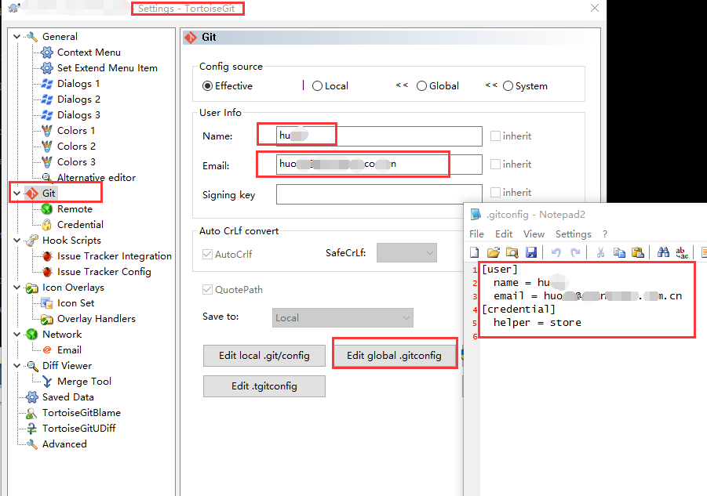

## TortoiseGit 保存用户名及密码

### 方法一：

TortoiseGit 1.8.1.2 及其后版本，右键菜单，`TortoiseGit ` - `Setings` - `Git` - `Credential` - 根据自己的需求做出选择。


### 方法二：

右键菜单，`TortoiseGit ` - `Setings` - `Git` - `Edit global .gitconfig`



```
[user]

  name = Honye

  email = hongye.jun@qq.com

[credential]

  helper = store
```

此方法会在 `C:\User\Administrator` 目录下生成 `.git-credentials` 文件，里面记录着用户名和密码


