# Windows GIT客户端安装

## 安装Git

从 [Git 官网][git]下载安装

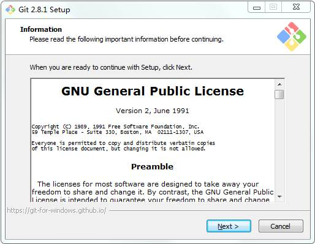

默认，下一步

 

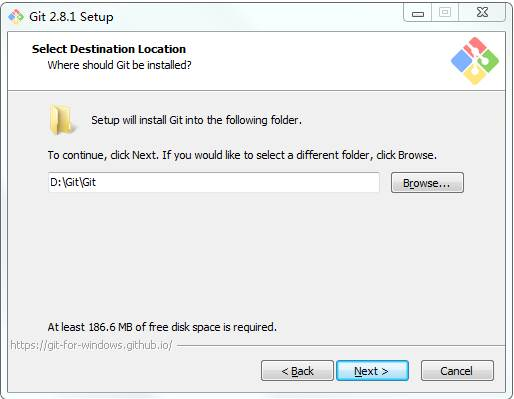

指定安装路径，下一步

 

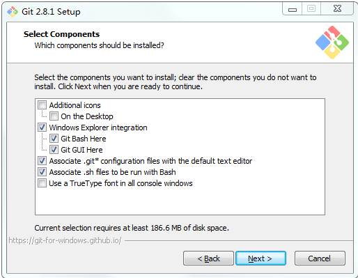

默认，下一步

默认，下一步

 

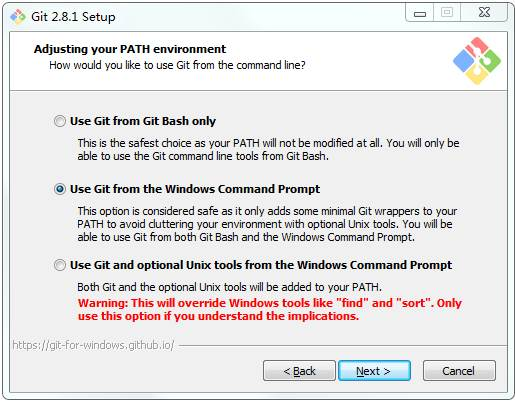

默认，下一步

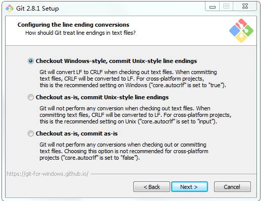

默认，下一步

 

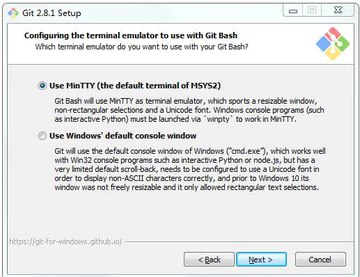

默认，下一步

默认，下一步

 

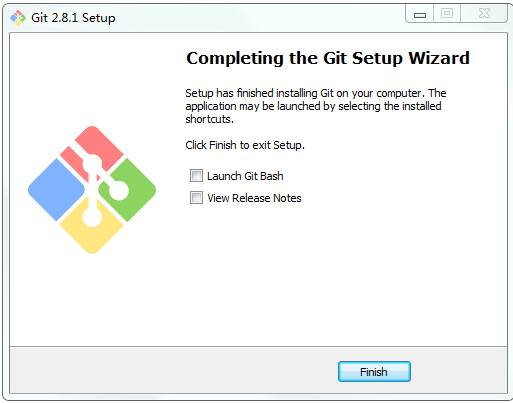

默认，下一步

 

## 安装ToroiseGit

点击TortoiseGit-2.1.0.0-64bit.msi

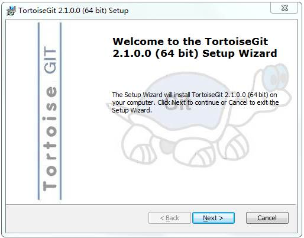

默认，下一步

 

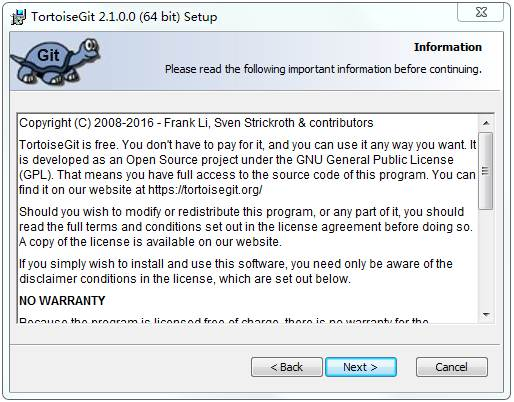

默认，下一步

 

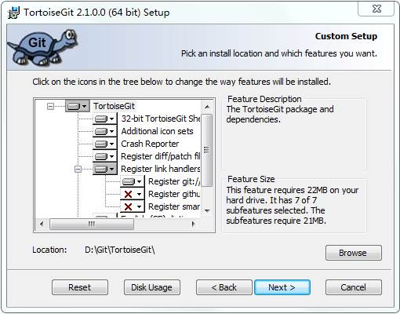

制定安装路径，下一步

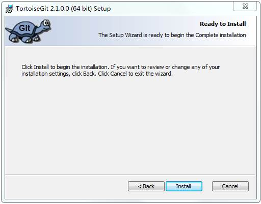

默认，安装

 

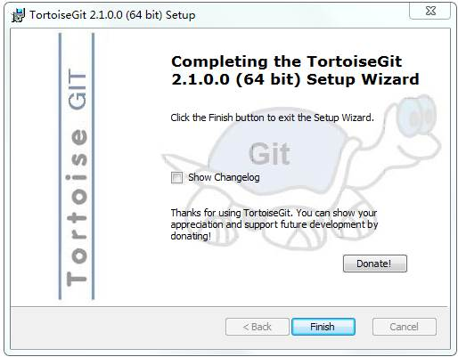

完成

 

右键点击空白处，弹出关联菜单，选择Git Bash Here

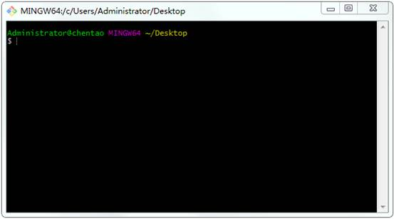

 

输入ssh-keygen –trsa生成公钥和密钥（一直回车）

执行该命令后，在C:\Users\Administrator目录下生成了.ssh目录，进入.ssh目录，可看到生成的文件如下：

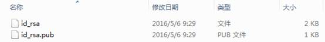

邮件点击空白处，选择TortoiseGit=>Settings=>Git，输入用户名和邮箱（以各自的内网邮箱为准）

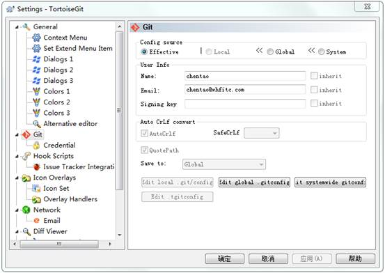

打开开始菜单=>TortoiseGit=>Puttygen

 

点击Load按钮，选择id_rsa文件

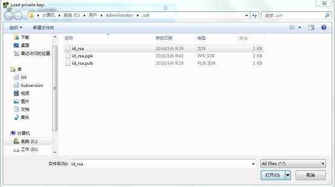

 

弹出如下界面

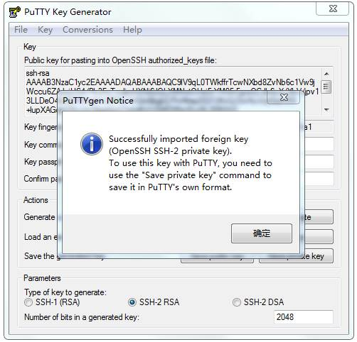

点击确定，然后点击Saveprivate key来保存私钥，保存到C:\Users\Administrator\.ssh路径下，文件命名为id_rsa.ppk；示例图如下：

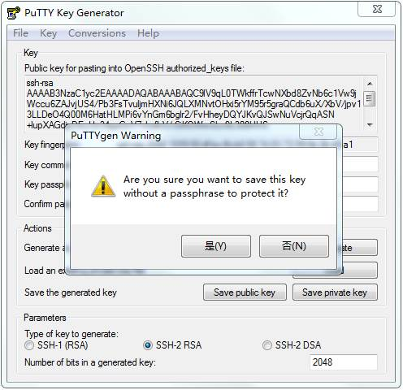

选择是

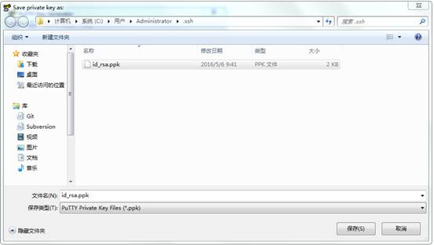

然后保存

 

选择TortoiseGit=>Settings=>NetWork,确保SSh-client的路径与安装路径一致

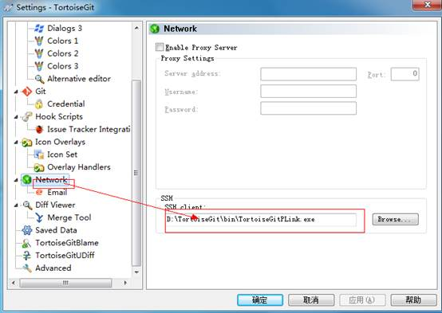

**将公钥传输到服务器**。

输入地址[http://192.168.1.11](http://192.168.1.11/)，注册，申请权限，进行登录

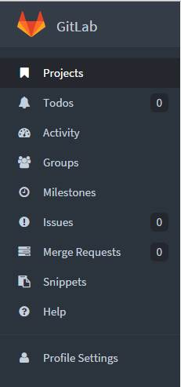

点击ProfileSettings

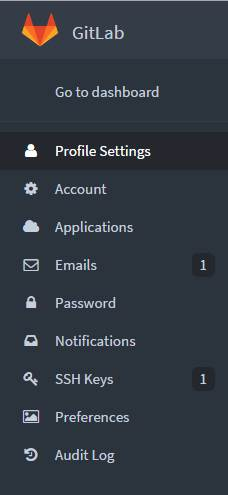

选择SSH Keys

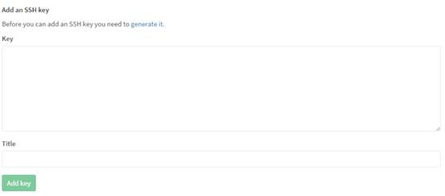

将id_rsa.pub文件内容全部复制粘帖到Key文本框中，点击Add key即可添加公钥

 

 

## 克隆

邮件点击空白处，选择GitClone

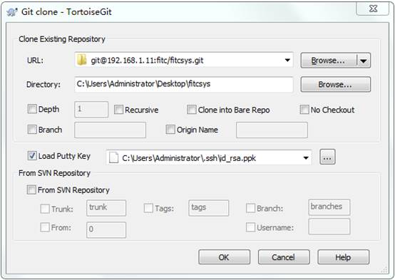

**注意加：** **转化后的私钥PPK** **文件。**

其中，URL填写项目的SSH路径，Direcotry填写本地目录；可在gitlab中查看具体的SSH路径，示例图如下：

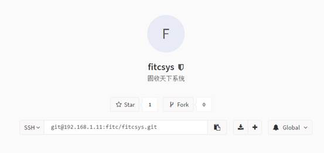

 

然后点击OK，进行项目克隆

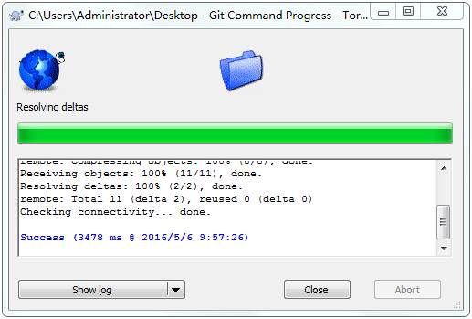

此时，项目克隆成功，表明前面的配置配置成功。

[git]: https://git-scm.com/