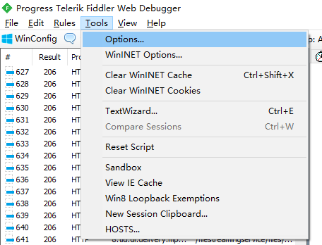
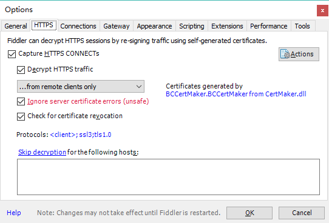
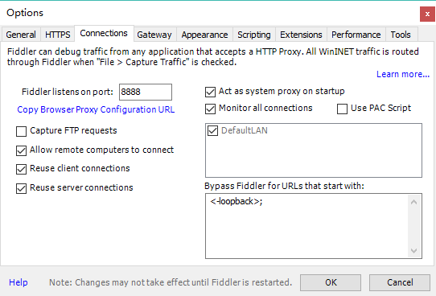
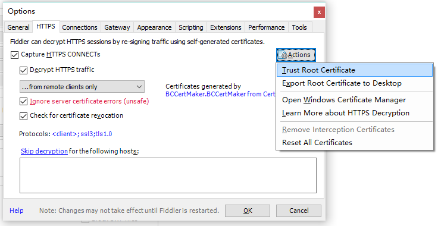
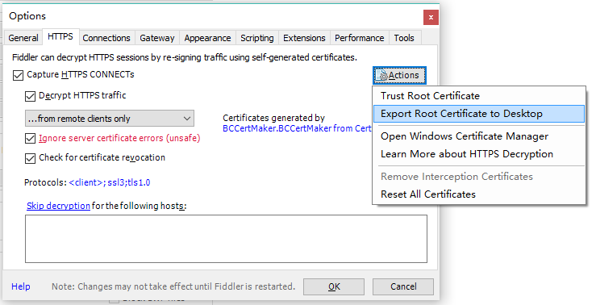
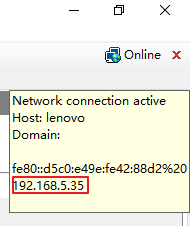
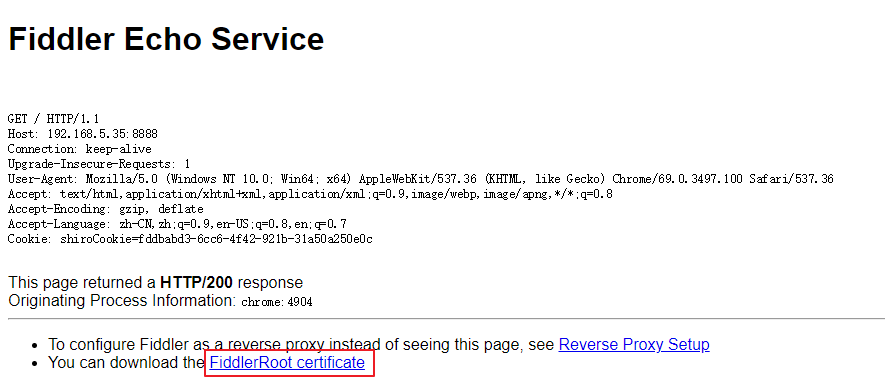
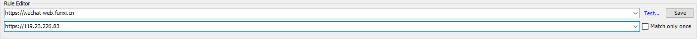
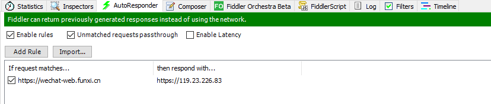
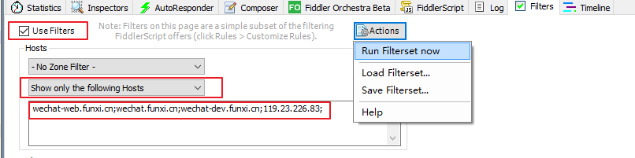

# Fiddler 抓包移动端 HTTPS

Fiddler 下载地址：<https://www.telerik.com/fiddler>

Fiddler 官文：<http://docs.telerik.com/fiddler/Configure-Fiddler/Tasks/ConfigureFiddler>

## 配置

1. 设置抓包 HTTPS

   菜单Tools - Options - HTTPS，勾选 Capture HTTPS CONNECTs、Decrypt HTTPS traffic、Ignore server certificate errors (unsafe) 等选项。

   若只抓移动端，可选择 ...from remote clients only。

   

   

   ​		进入 Connections，勾选 Allow remote computers to connect 允许远程设备连接。

   

2. 安装证书

   进入 Options - HTTPS，点击 Actions - Trust Root Certificate。

   

   再次点击 Actions - Export Root Certificate to Desktop，用于浏览器导入。

3. 手机下载并安装证书

   鼠标移动到 Fiddler 右上角 Online 可看到本机 IP（Fiddler 主机 IP）。

   ​		

   手机设置代理，服务器为 Fiddler 主机 IP，端口为 8888。

   手机浏览器访问 http://\<Fiddler 主机 IP>:8888，点击下图红框位置下载证书。

   

   iOS 10 以上需要进入设置 - 通用 - 关于本机 - 证书信用设置手动信任 DO_NOT_TRUST_FiddlerRoot 证书。

## 使用

以微信公众号为例。

### 重定向

将 https://wechat-web.funxi.cn 映射到 https://119.23.226.83。

选择右侧 AutoResponder，勾选 Enable rules，点击 Add Rules 添加一条如下图记录，点击 Save 保存。

### 过滤指定域名

选择右侧 **Filters**，勾选 **Use Filters**，Host Filter 选择 **Show only the follwing Hosts**，在编辑框中填入 `wechat-web.funxi.cn;wechat.funxi.cn;wechat-dev.funxi.cn;119.23.226.83;` 后，点击 **Actions** - **Run Filterset now** 使过滤生效。

最后微信打开公众号或者打开 https://wechat-web.funxi.cn 就能正常使用了。

## 其他

若经过上述操作还是不能捕捉到 HTTPS，可以尝试下载 [CertMaker 插件](https://www.telerik.com/fiddler/add-ons)。

先删除之前 Fiddler 生成的所有证书。Win + R，输入 certmgr.msc，操作 - 查找证书，搜索 Fiddler，全部删除。

安装插件后，重启 Fiddler，重新配置。

参考：[Capture Traffic from iOS Device](http://docs.telerik.com/fiddler/Configure-Fiddler/Tasks/ConfigureForiOS#capture-traffic-from-ios-device)