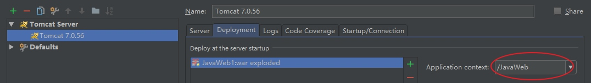

### `WEB-INF` 目录结构
1. WEB-INF 是 Java 的 Web 应用的安全目录。所谓安全就是客户端无法访问，只有服务端可以访问的目录；
2. web.xml 文件是项目部署文件；
3. classes 文件夹用以放置 *.class 文件；
4. lib 文件夹用于存放需要的 jar 包。
> web.xml
```xml
<!--配置默认欢迎页 可配置多个-->
<welcome-file-list>
    <!-- 以 "/" 开头代表项目根目录-->
    <welcome-file>/index.jsp</welcome-file>
</welcome-file-list>
```

### IDE 环境配置
略 JavaEE

### 修改项目虚拟访问路径


修改后访问`localhost:8080/JavaWeb/`，大小写敏感。

