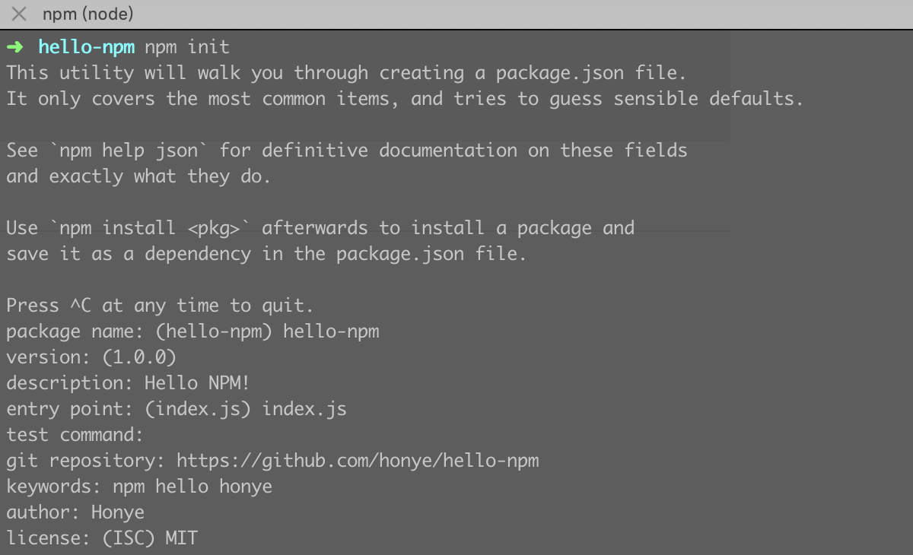
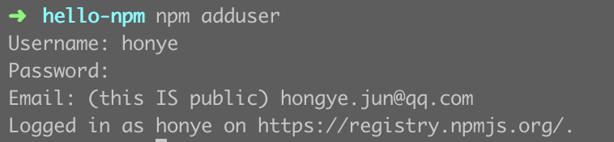

## 写

进入工作目录 `npm init`



创建 `index.js`

```javascript
function hello(name) {
  console.log('Welcome ' + name + '!')
  return 'Hello ' + name + '!'
}

module.exports = hello
```

## npm

还没 npm 账户？[注册](https://www.npmjs.com/signup)

### 登录

```shell
npm login  #或 npm adduser
```



注意：`Logged in as honye on https://registry.npmjs.org/`

如果设置了镜像会报错

```
is not in the npm registry
```

需要改回原先的

```shell
npm config set registry https://registry.npmjs.org/
```

### 发布

```shell
npm publish
```

如果包名为 `@honye/hello` 这种 `scoped package`，需要

```shell
npm publish --access=public
```

### 试用

```shell
npm install @honye/hello
```

```javascript
const hello = require('@honye/hello')
const helloWorld = hello('world')
console.log(helloWorld)
```

## 更新

```shell
npm version patch  # 修复 BUG
npm publish
```

`npm version` 参数说明：

1. `patch`：小改动，如修复 BUG，版本号变动 v1.0.0 -> v1.0.1
2. `minor`：增加新功能且不影响现有功能，版本号变动 v1.0.0 -> v1.1.0
3. `major`：带有兼容性问题的大版本迭代，版本号 v1.0.0 -> v2.0.0

## 撤销发布

```shell
# 不推荐。会删除社区包
npm unpublish
npm unpublish @honye/hello@0.0.1-beta
npm unpublish @honye/hello --force
# 推荐。不会在社区撤销已有的包，但会在安装时给出警告
npm deprecate @honye/hello
```

## FAQ

> error code E403
>
> error 403 403 Forbidden - PUT https://registry.npmjs.org/hello - Forbidden
>
> error 403 In most cases, you or one of your dependencies are requesting
>
> error 403 a package version that is forbidden by your security policy.

检查邮箱是否通过验证。登录 npm 并验证邮箱
