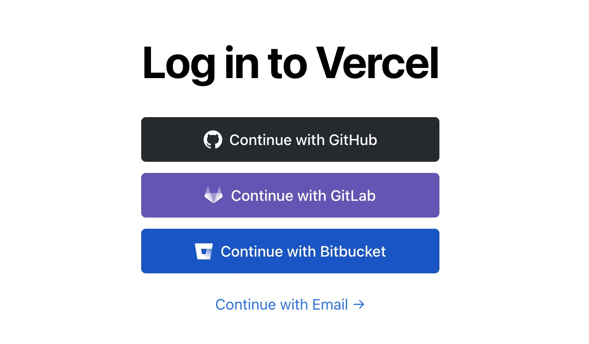
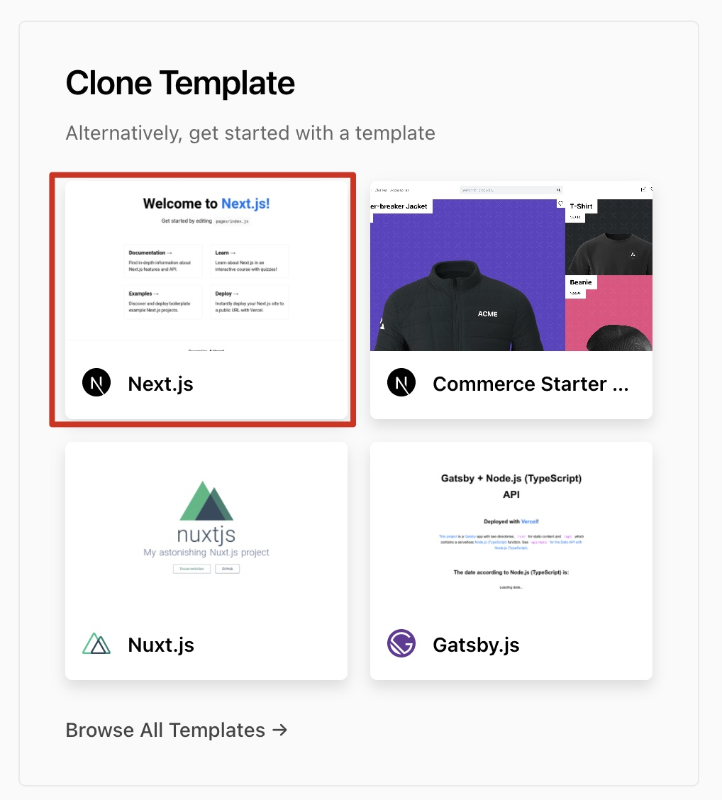

想写一个 GitHub 的拓展小程序，[GiHub Trending](https://github.com/trending) 必不可少。可 GitHub 未提供 Trending 的 API，只能自己爬了。

方案一：小程序 `wx.request` 请求网页得到 HTML 字符串后解析；

方案二：使用云函数请求网页得到 HTML 字符串后解析；

我选择了方案二

噼里啪啦写完了，上线。然后发现云函数访问不了外网，无法使用手机的代理服务，GitHub 在国内也很不稳定，所以经常会请求挂掉。

无意间发现 [Vercel](https://vercel.com) 在国内的访问速度不错，又能免费托管云函数，就想到通过 Vercel 代理请求 GitHub Trending，想到就干，弄完效果还不错，不会挂了。

### 登录/注册 Vercel



### 新建 Next.js 项目

新建 [Next](https://nextjs.org/) 项目，未接触过 Next 和 Vercel 的同学可以使用 Vercel 提供的 [Next.js 模版](https://vercel.com/new/select-scope?s=https%3A%2F%2Fgithub.com%2Fvercel%2Fvercel%2Ftree%2Fmaster%2Fexamples%2Fnextjs&template=nextjs&id=67753070&b=master)。Vercel 项目需要仓库托管，可一键克隆模版项目到 GitHub。



### 编写 API

主要思路是请求网页 HTML 字符串使用 [cheerio](https://github.com/cheeriojs/cheerio) 解析。

在项目 `api/` 文件夹下新建 `trending.js`（`api/` 文件夹内文件都会自动转为 Node.js 服务，参考 [API Routes](https://nextjs.org/docs/api-routes/introduction)），编写请求方法。如何解析我就不赘述了，访问网页打开调试自己找规律就好，直接上代码

```javascript
import fetch from 'node-fetch';
import cheerio from 'cheerio';

const fetchTrendingList = async () => {
  const url = 'https://github.com/trending';
  const text = await fetch(url).then((data) => data.text());
  const $ = cheerio.load(text);
  const list = $('.Box .Box-row')
    .get()
    .map(repo => {
      const $repo = $(repo);
      const title = $repo.find('.h3').text().trim();
      const [owner, name] = title.split('/').map(v => v.trim());
      const description = $(($repo.children())[2]).text().trim();
      const language = $repo.find('[itemprop="programmingLanguage"]').text().trim();
      const starCount = $repo.find('[aria-label="star"].octicon.octicon-star').parent().text().trim();
      return {
        owner: {
          login: owner,
          avatar_url: `https://github.com/${owner}.png`
        },
        name,
        description,
        language,
        stargazers_count: starCount
      };
    });
}

export default async (req, res) => {
  const resp = await fetchTrendingList();
  res.status(200).json(resp);
}
```

上传到 Git 仓库后触发 Vercel 构建部署，现在访问 `https://<vercel-projectname>.vercel.app/trending` 即可得到 JSON 返回。

以上不支持筛选参数，接下来增加几行代码是 API 和 GitHub Trending 保持一致。

```javascript
/**
 * 增加参数支持，参数均为可选
 *
 * @param {object} params
 * @param {string} [params.language] Language
 * @param {'daily'|'weekly'|'monthly'} [params.since] Date range
 * @param {string} [params.spoken_language_code] Spoken Language
 */
const fetchTrendingList = async (params) => {
  let url = 'https://github.com/trending';
  // 结构出路径参数
  const { language, ...query } = params;
  if (language) {
    url += `/${language}`
  }
  // 组合 query 字符串
  const queryString = Object.keys(query).map((key) => `${key}=${query[key]}`).join('&');
  if (queryString) {
    url += `?${queryString}`;
  }
  
  const text = await fetch(url).then((data) => data.text());
  // ... 后面的无需改动
}

export default async (req, res) => {
  // 传递 req.query
  const resp = await fetchTrendingList(req.query);
  res.status(200).json(resp);
}
```

现在 API 支持了筛选参数，但还没结束。当你访问 `https://<vercel-projectname>.vercel.app/api/trending/javascript` 时会报 404。因为该路由文件不存在。

一种方案是使用 Next 的[动态路由](https://nextjs.org/docs/api-routes/dynamic-api-routes) `api/trending/[language].js`，但是这样并不会匹配 `api/trending`，[官方方案](https://nextjs.org/docs/api-routes/dynamic-api-routes#index-routes-and-dynamic-api-routes)是创建两个路由文件 `api/trending/index.js` 和 `api/trending/[language].js`。要么是相同的代码写两份，要么是写个公用方法引用。

我觉得麻烦，最终采用的 next.config.js 的 [Rewrites](https://nextjs.org/docs/api-reference/next.config.js/rewrites) 配置实现。项目没有 next.config.js 文件的新建。

```javascript
module.exports = {
  async rewrites () {
    return [
      // :language 必须和 trending.js 里的请求参数 language 一致，language 会包含在 req.query 里
      { source: '/api/trending/:language', destination: '/api/trending' }
    ];
  }
}
```

到此为止是真的结束了，和 GitHub Trending API 一致。源码就不提供了，都在文章里。

| GitHub                                            | 扫码体验                                                     |
| ------------------------------------------------- | ------------------------------------------------------------ |
| [weapp-mark](https://github.com/honye/weapp-mark) |  |