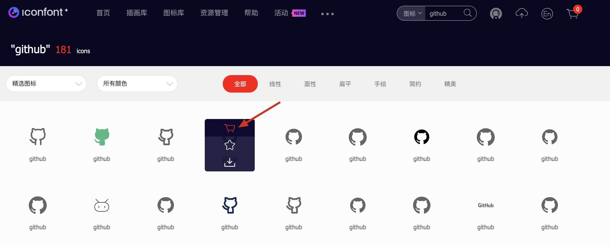

# 小程序使用 IconFont 字体

1. 访问 [IconFont](https://www.iconfont.cn/)，搜索需要使用的图标

2. 选择图标添加入购物车

   

3. 查看购物车，将图标添加至项目。事先没有创建项目的可以新建项目

   

   

4. 选择 Font Class，查看在线链接并复制代码

   

5. 浏览器窗口粘贴访问刚刚复制的链接

6. 复制链接内容，粘贴到小程序项目内 iconfont.wxss

   

7. 某些图标可能因为已有同名的其他图标名字比较丑陋，可以自行修改。修改后会生成新的链接，需要重新复制样式

   

8. 小程序引用 iconfont.wxss，使用 iconfont class

   ```xml
   <text class="iconfont icon-github" />
   ```

| GitHub                                            | 示例                                            |
| ------------------------------------------------- | ----------------------------------------------- |
| [weapp-mark](https://github.com/honye/weapp-mark) |  |