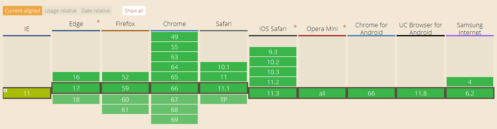

# flex 兼容

[](https://caniuse.com/#feat=flexbox)

[Flex 布局教程 --阮一峰](http://www.ruanyifeng.com/blog/2015/07/flex-grammar.html)

[使用Flexbox：新旧语法混用实现最佳浏览器兼容](https://www.w3cplus.com/css3/using-flexbox.html)

样式书写先后顺序，新语法在最后，如下：

```css
.selector {
    /* display */
	display: -webkit-box;    /* OLD - iOS 6-, Safari 3.1-6 */ 
    display: -moz-box;       /* OLD - Firefox 19- (buggy but mostly works) */ 
    display: -ms-flexbox;    /* TWEENER - IE 10 */ 
    display: -webkit-flex; 	 /* NEW - Chrome */ 
    display: flex;           /* NEW, Spec - Opera 12.1, Firefox 20+ */
    
    /* flex */
    -webkit-box-flex: 1; /* OLD - iOS 6-, Safari 3.1-6 */ 
    -moz-box-flex: 1;    /* OLD - Firefox 19- */ 
    width: 20%;          /* For old syntax, otherwise collapses. */ 
    -webkit-flex: 1;     /* Chrome */ 
    -ms-flex: 1;         /* IE 10 */ 
    flex: 1;             /* NEW, Spec - Opera 12.1, Firefox 20+ */
}
```

