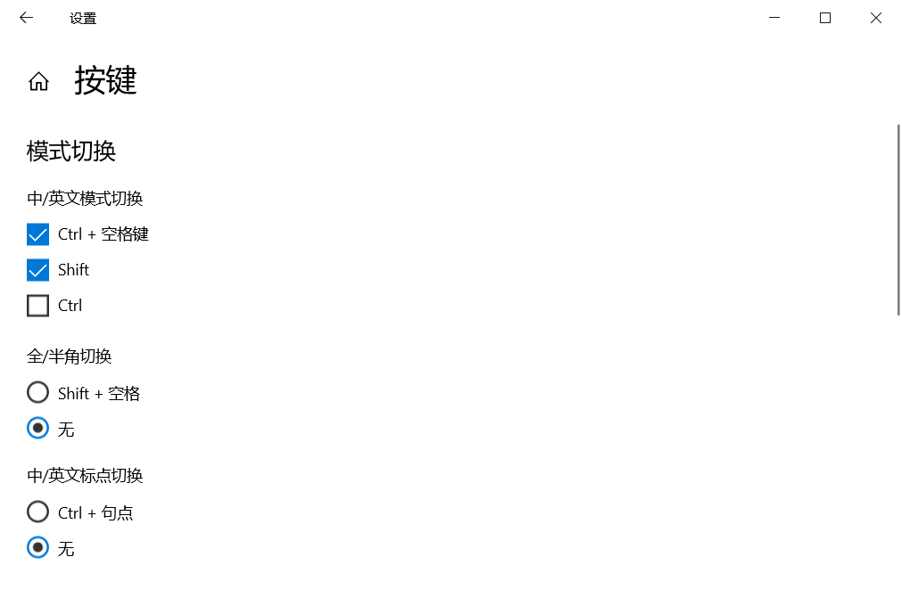

# Windows 使用 CapsLock 切换中英文模式

在家使用自己的 Mac，工作中使用公司分配的 ThinkPad，MacOS 和 Windows 输入法切换中英文模式快捷键不一样，很是别扭。常大写模式很少用，个人感觉 MacOS 使用 Shift + 字母输入大写更舒适。借助 [AutoHotkey](https://www.autohotkey.com) 使 Windows  像 MacOS 一样使用 **CapsLock** 切换中英文模式

## 脚本

实现如下功能：

- 点按切换中/英文模式
- 长按切换大小写模式

首先确认系统输入法按键设置中**中/英文模式切换**勾选了 **Ctrl + 空格键**



编写脚本

```
#NoEnv

SetCapsLockState, Alwaysoff
SetStoreCapsLockMode, Off

CapsLock::
KeyWait, CapsLock, T0.3
If ErrorLevel {
  Send, {CapsLock}
  KeyWait, CapsLock
} else {
  Send, {Ctrl down}{Space down}{Space up}{Ctrl up}
}
```

## 开机启动

按下 **Win + R**，输入 **shell:startup** 后回车打开开机启动文件夹，复制（或复制脚本的快捷方式）到启动文件夹即可

启动文件夹一般为：

```
C:\Users\<UserName>\AppData\Roaming\Microsoft\Windows\Start Menu\Programs\Startup
```

如果希望多个脚本开机启动，建议将多个脚本合并在一个文件后放入启动文件夹

## 感谢

- [Windows下Capslock键切换中英文](https://blog.csdn.net/crt106/article/details/103657186)
- [Add an app to run automatically at startup in Windows 10](https://support.microsoft.com/en-us/windows/add-an-app-to-run-automatically-at-startup-in-windows-10-150da165-dcd9-7230-517b-cf3c295d89dd)
